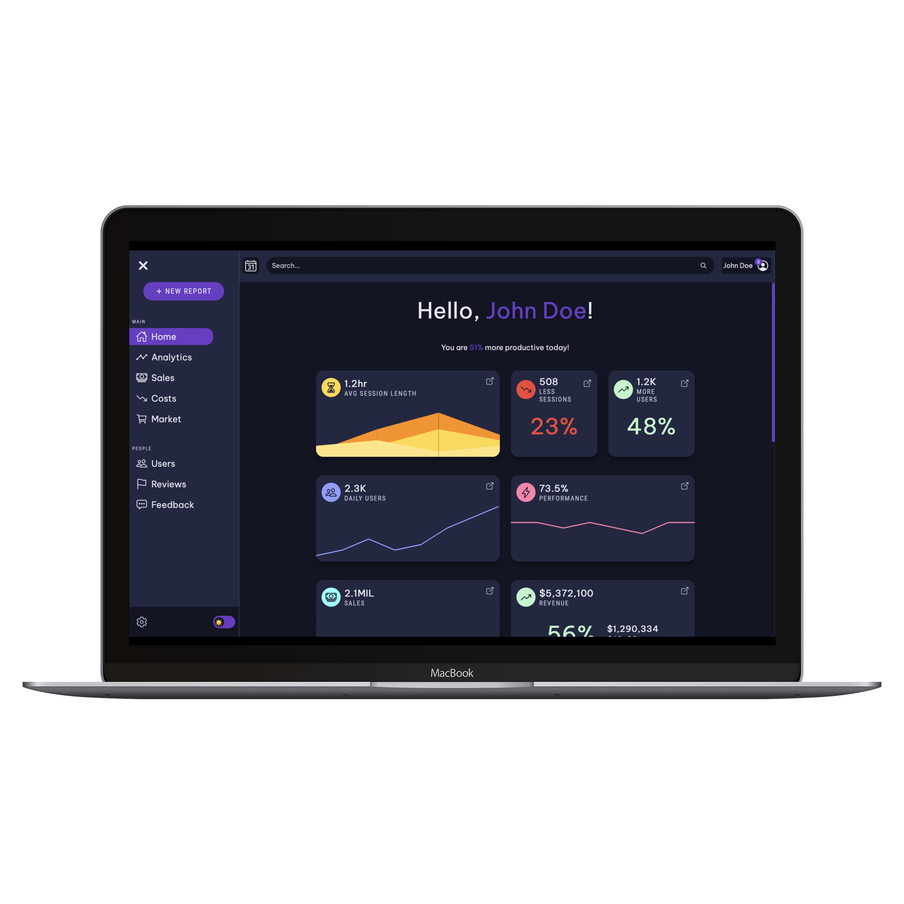
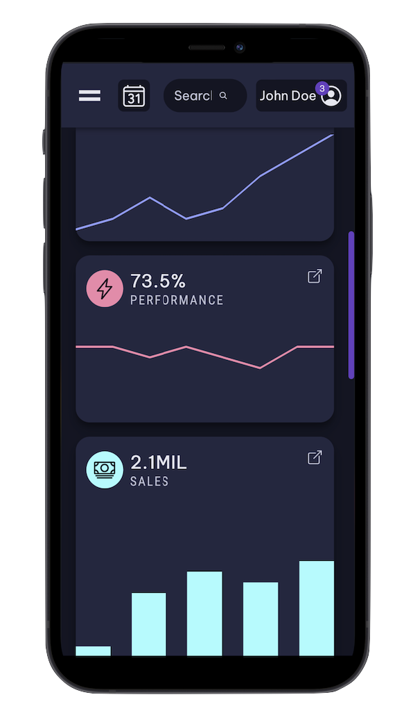
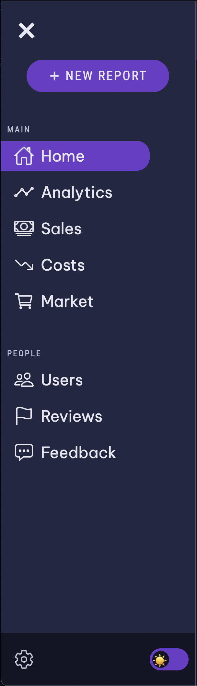
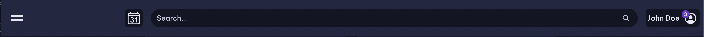
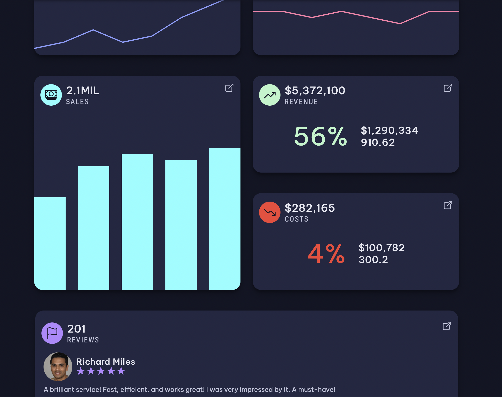
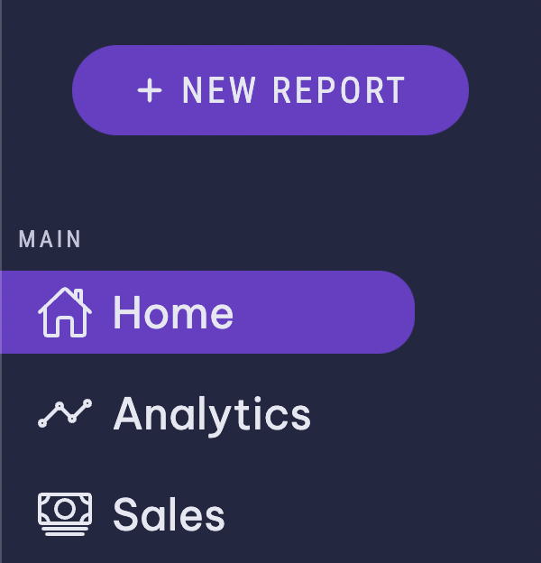
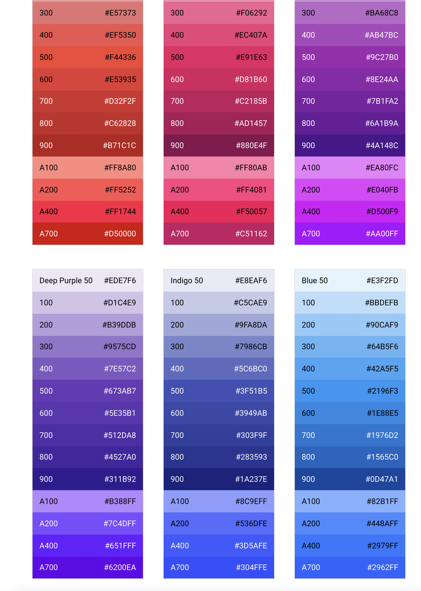

# Dashboard 📈

# Hey!! 👋

Hope you you're doing well! 

I made the front-end of a dashboard, in `HTML`, `CSS`, and a tiny bit of `JS`!

It's completely **responsive**, meaning you can view and use it perfectly on any type of device. It also has a **dark and light theme**, as well as many cool animations!

Here's how a bit how looks it like: 

This is how it looks like on a phone:

Important to know; this is just the front-end and the design of the dashboard. It doesn't *actually* work or have any *real* data in it. However, feel free to [fork the repl](https://replit.com/@Bookie0/Dashboard?v=1) and make it functional! :)

***

## Links 🔗

* [Site/Demo ==> Dashboard.bookie0.repl.co](https://Dashboard.bookie0.repl.co)

* [Code ==> replit.com/@Bookie0/Dashboard](https://replit.com/@Bookie0/Dashboard#README.md)

* [Spotlight/Apps page ==> replit.com/@Bookie0/Dashboard?v=1](https://replit.com/@Bookie0/Dashboard?v=1)

* [Post ==> replit.com/talk/share/Dashboard/146629](https://replit.com/talk/share/Dashboard/146629)

***

## Features ✨

**Sidebar**

- Pushes content to the side (on smaller devices, overlaps content)
- CTA `+ NEW REPORT` button
- Different sections (`MAIN`, `PEOPLE`) 
- Each with different tabs (as well as an active tab)
  - Main: Home, Analytics, Sales, Costs, Market
  - People: Users, Reviews, Feedback
- Bottom section is fixed and has settings icon as well as dark/light theme toggle

**Topbar**

- Calendar icon
- Search box with search icon
- Profile with username, profile picture, and notification

**Content**

- Friendly message to user
- Contains several types of (fake) data with different sizes:
  - Rect (`1` x `2`)
  - Small (`1` x `1`)
  - Big (`2` x `2`)
  - Large (`4` x `2`)
- Each data card has an icon, title, value, and description, as well as icon to open more detailed view (doens't actually exist)
- Below, there's the actual data under a graph, big number, or text

**Average session length**

- Multiple area graph

**Less sessions/More users**

- Big number

**Daily users/Performance**

- Line graph

**Sales**

- Column graph

**Revenue/Costs**

- Big number 
- Smaller numbers next to it

**Reviews**

- Picture of reviewer and name
- Number of stars (on 5)
- Review

## Style

**Font family**

The font family I used is `'Be Vietnam Pro', sans-serif`, a font from [Google Fonts](https://fonts.google.com/specimen/Be+Vietnam). It's a smooth and modern font that looks good with technology. 

I also used a secondary font: `'Roboto Condensed', sans-serif` (also from [Google Fonts](https://fonts.google.com/specimen/Roboto+Condensed)). It's a sort of thin, condensed (like the name implies) font that is more straight. When I used it, the text was in all caps and there was also a letter spacing of `2px`. This is because I feel like SC (small caps) fonts look very big and imposing, so having some space between each letter makes it a bit less 'forceful'.

These 2 fonts are a bit opposing each other and I much like the contrast. Here's an example of how they look like together:

**Colors**

There are 2 different color schemes; one for dark mode and one for light mode. I showed how dark mode looks like at the top, and light mode looks like this:

As you can see, almost all the colors; accent color, primary, secondary, colors for the graphs and numbers, etc. have changed. In light mode, the colors are more saturated and sort of 'brighter', as compared to the dark theme. 

I got inspiration for the different colors from [Google's Material Design](https://material.io/design/color/the-color-system.html#tools-for-picking-colors) color-picking tool. It shows many different colors with different amounts of saturation or intensity of that same color. These different intensities were used for the different themes.

**Icons**

I've used many icons in this site, for example in the sidebar with each tab (Home, Analytics, Sales, Costs, etc.), or in the top bar, and also in the main content for each data item. 

These icons come from [Ionicons](https://ionic.io/ionicons), a great library filled with beautiful icons that you can also customize.

**Animations**

There are several animations in this site. For example, when you hover on any of the icons in the sidebar, they rotate to the right a bit. When you hover on the icons in the top right corner of each data container, they move to the top and right. The elements in the topbar also become a bit bigger on hover. Finally, when you hover on the cross symbol to close the sidebar, it spins, and when you hover on the hamburger icon to open the sidebar, the lines seperate.

**Charts**

The charts come from [Charts.css](https://chartscss.org/), a great framework for data such as columns, areas, bars, lines, etc. What's cool is that they are rather simple to use, and you can customize their colors, shapes, and values, and can even add animations or motion effects. You can get started [here](https://chartscss.org/docs/).

**Faces**

The faces used in the reviews data container are all fake and generated with AI. They were generated with [this face generator](https://generated.photos/face-generator/new). With this generator, you get a completely random face, or tweak things such as age, emotions, skin/hair color, and much more!

***

## Closing 🚪

Well, that's about all! Make sure to let me know any comments, suggestions, or questions if you have them! :D 

### If there are any issues/bugs/things breaking, please comment them or DM me on Discord  @ `Bookie0#7538`.

*If you use this dashboard template/site, please keep in mind that I'd love if you gave credit (like in the footer of your website or something), as I did put some effort into this! :)*

### Have a fantastic day!!!

# Bye! 👋

